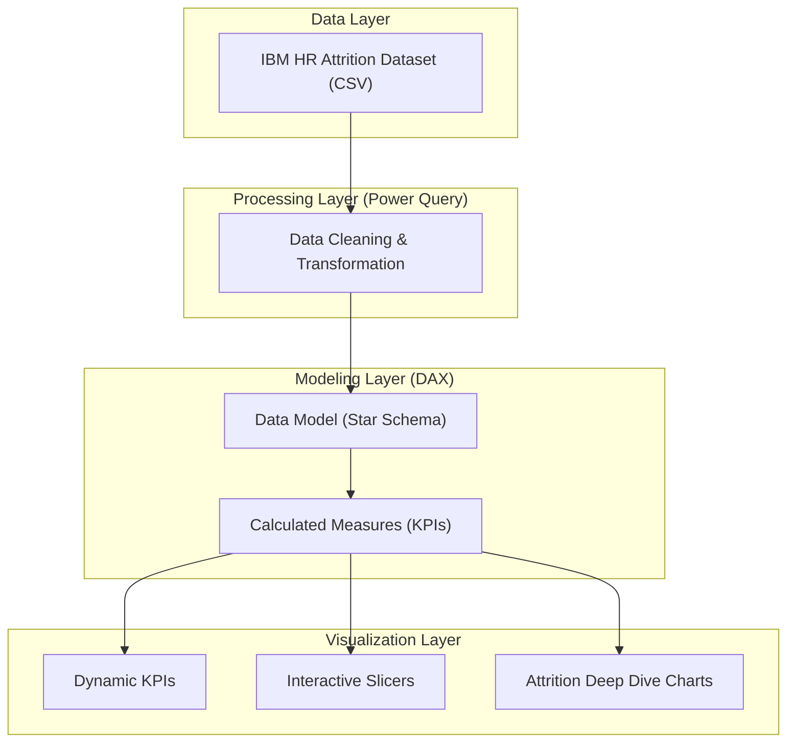
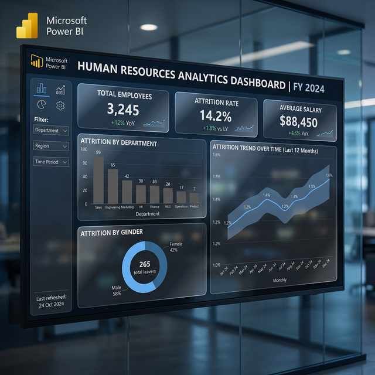

# Human Resources Analytics Dashboard


## Project Overview
The Human Resources Analytics Dashboard is a comprehensive Power BI solution designed to help HR departments track employee attrition, monitor workforce demographics, and identify key drivers behind employee turnover. Using the IBM HR Attrition Dataset, this project transforms raw data into actionable insights to improve employee retention.

## Project Goals
| Goal | Description |
| :--- | :--- |
| **Identify Attrition Trends** | Visualize which departments, job roles, and age groups have the highest turnover. |
| **Analyze Employee Satisfaction** | Correlate job satisfaction, environment satisfaction, and work-life balance with attrition. |
| **Economic Impact** | Monitor salary distributions and their relationship with employee exits. |
| **Data-Driven Retention** | Provide HR managers with specific data points to implement targeted retention strategies. |

## Dashboard Architecture
The following diagram illustrates the data flow and architecture of the dashboard:



## Dashboard Visualization

*A professional visualization of the Human Resources Analytics Dashboard.*

## Key Metrics (KPIs)
* **Total Employees**: Total headcount across all departments.
* **Attrition Rate**: Percentage of employees who have left the company.
* **Average Salary**: Evaluation of compensation across the workforce.
* **Average Tenure**: Insights into the length of service within the organization.

## Tech Stack & Tools
* **Power BI Desktop**: Data modeling and visualization.
* **Power Query**: Data cleaning and transformation (ETL).
* **DAX (Data Analysis Expressions)**: Advanced calculations and custom measures.
* **Excel/CSV**: Source data management.

## Dashboard Features
* **Interactive Slicers**: Filter by Department, Job Role, Gender, and Education.
* **Dynamic KPIs**: Real-time updates of core metrics.
* **Attrition Deep Dive**: Specialized charts focusing on Overtime, Age Groups, and Years at Company.
* **Employee Demographics**: Visual breakdown of the workforce by various factors.

## Key Insights
*Data based on 1,470 employee records (IBM HR Dataset)*

* **Overtime Impact**: Employees working overtime have a 30.5% attrition rate, double the company average.
* **Critical Age Group**: Turnover is highest among employees aged 25-35.
* **Income Threshold**: Employees earning less than $5,000/month show significantly higher exit rates.
* **Departmental Focus**: The Sales department exhibits the highest percentage of attrition compared to R&D and Human Resources.

## DAX Measures
```dax
Total Employees = COUNTROWS('HR_Data')

Total Attrition = CALCULATE(COUNTROWS('HR_Data'), 'HR_Data'[Attrition] = "Yes")

Attrition Rate = DIVIDE([Total Attrition], [Total Employees])

Average Salary = AVERAGE('HR_Data'[MonthlyIncome])

Average Tenure = AVERAGE('HR_Data'[YearsAtCompany])
```

## Repository Structure
```text
├── Data/                # Raw CSV data and documentation
├── Human Resources Analytics Dashboard.pbix # Power BI Main File
├── dax_readme_and_sample_visualizations.pdf # Visual reference
└── README.md            # Project documentation
```

## Future Scope
* **Predictive Analytics**: Implementing machine learning models to predict future attrition.
* **Trend Analysis**: Integrating time-series data to see attrition changes over quarters.
* **Manager Feedback Integration**: Adding sentiment analysis from employee reviews.

---
MIT License

